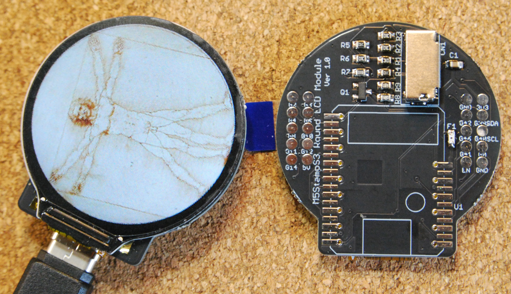
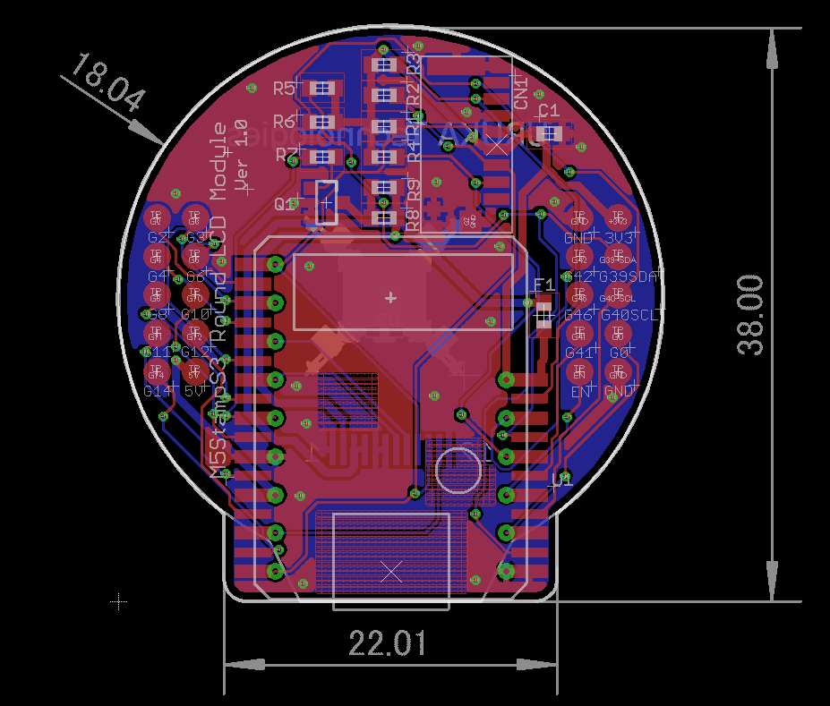

# M5StampS3ラウンド液晶モジュール

写真の基板は赤色ですが、量産版の基板は黒色です

M5StampS3を使用して1.28インチ240ｘ240ドットの円形液晶を駆動する基板モジュールです。

円形液晶の裏にM5StampS3を配置することで、とても小さくスリムな形状になりました。

円形液晶にはGC9A01というコントローラーが使用されていますが、対応したグラフィックライブラリが数種類公開されています。

本モジュールは「グラフィックライブラリの使い方を理解して液晶モジュールを駆動出来る人」をターゲットにしております。

# 注意！！（必ずお読み下さい）

本品は基本的な電子回路の仕組みを理解した方を対象とした、電子部品がむき出しの半完成キットです。
電子部品は電源電圧や極性を間違えたり、部品を破損させたり部品端子をショートさせた場合、発熱・発煙・発火に至る場合もあります。
間違った使い方をすると危険である事を理解された方のみご使用ください。
趣味の電子工作向けに製作しておりますので、製品への組込みや日常生活へ組込んでのご使用はお控え下さい。

# 形状および回路図

以下に外形イメージを示します

以下に回路図を示します　現在最新は基板Ver1.0です

試作版のVer0.1の図面は以下に保存しています

https://github.com/urukakanko/M5StampS3_round_lcd-/tree/main/ver0.1

# ピンアサイン

M5Stamp とLCDの制御信号とのピン接続は以下となります。

- SCLK:G1

- DATA-IN:G15

- DC:G7

- CS:G5

- RST:G13

- バックライト:G9　バックライトLEDのPIN設定は必ず行ってください。ハイインピーダンスとなった場合バックライトが不安定になります。

TFカードスロットのPIN接続は以下となります。（SCLKおよびMOSIは液晶と共通です）

- TF-MISO:G43
- TF-CS:44

また、以下の未使用PINはパットで引き出せるようにしました。I2C接続を想定しG39とG40にはプルアップをしています。

- G2,G3,G4,G6,G8,G10,G11,G12,G14,G39,G0,G40,EN,G41,G42,G46

  
注意：リード線をハンダ付けするパットとして使用します　コネクタやピンヘッダは挿せません。

# 使用するツールやライブラリ

M5StampS3の情報については、以下サイトを参考下さい。

https://docs.m5stack.com/en/core/StampS3

グラフィックライブラリについてはlovyanさまのLovyanGFXにて動作確認をしています。

https://github.com/lovyan03/LovyanGFX

他、GC9A01に対応したライブラリが使用可能と考えています。

# サンプルプログラム

LovyanGFXのClockSampleです

https://github.com/urukakanko/M5StampS3_round_lcd-/tree/main/M5stampS3_ClockSample

# LCD表示動画

メモリーカードから画像データを読み出して液晶に表示しています

[https://youtu.be/gN_2BcIaoQU](https://youtu.be/WFxbUNVwUNw)

未実装版のチェックをしている動画です

https://youtu.be/jMZeYKtBkwM

# 使用例

準備中

# 製作者

ウルカテクノロジー
Hiroyuki Sunagawa

https://www.facebook.com/URUKA-Technologies-105478404379918
